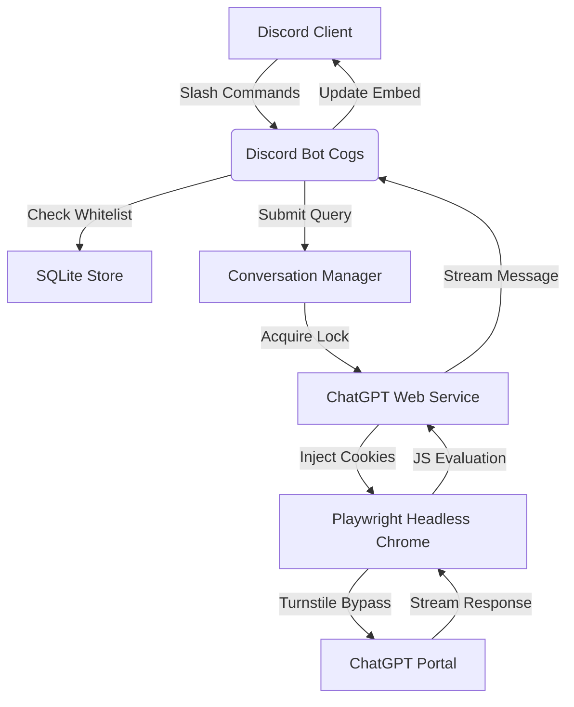
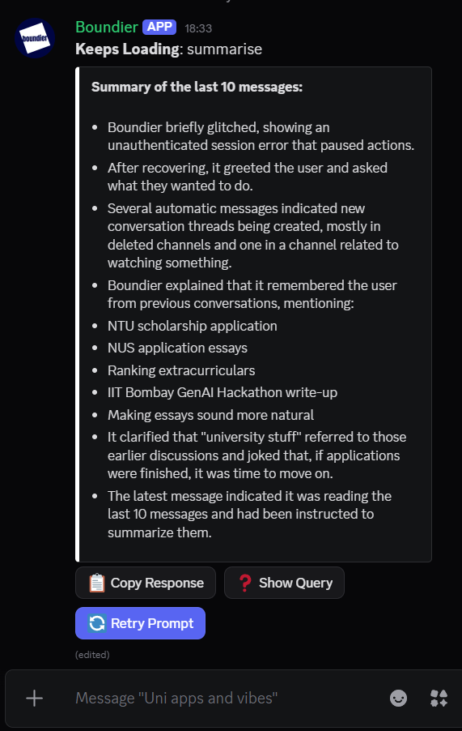
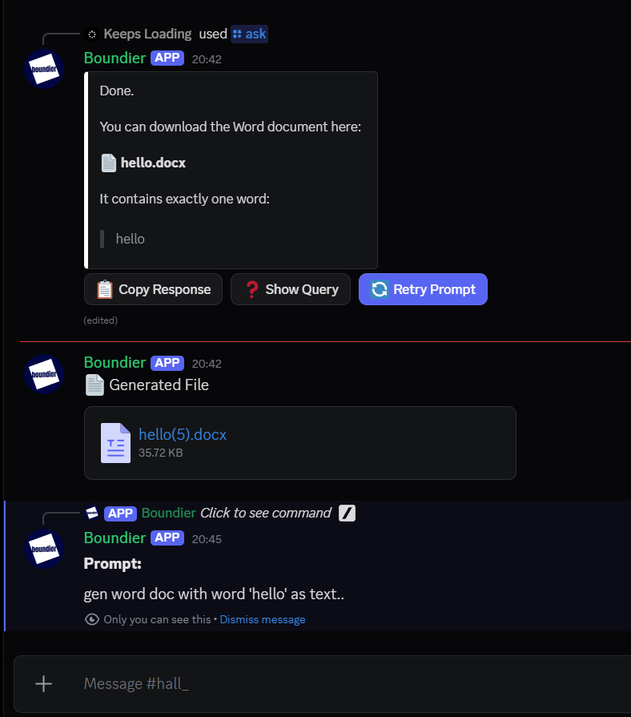

# Boundier 🤖 

### 💬 ChatGPT on Your Discord Server **for free, no API needed.** 🚀

[](https://python.org)
[](https://playwright.dev)
[](https://github.com/keepsloading/Boundier)
[](https://chatgpt.com)

> **Tired of paying per token? Boundier brings the ChatGPT experience (including ChatGPT, web search, memory, and file uploads) directly into your personal Discord server, completely free.**

**Boundier** connects your Discord server straight to ChatGPT **for free (without an API)**. Instead of routing through the expensive OpenAI API, it automates a headless Chromium session to link your actual ChatGPT account directly to Discord threads giving you full access to web search, file uploads, memory, and image generation at **$0 per message**.

The name signifies **"Breaking Boundaries"**: breaking free from API paywalls, rate limits, and token costs that make bringing ChatGPT to your server prohibitively expensive.

---

> [!WARNING]
> ## DISCLAIMER: FOR LEARNING & EXPERIMENTAL PURPOSES ONLY
>
> **Boundier** is an experimental hobby project created to explore browser automation, Playwright, persistent browser sessions, and Discord-native AI workflows. It is **intended as a personal assistant, not for production use, commercial deployment, or as a replacement for official APIs.**
>
> **This project is built with genuine respect for OpenAI and its work.** Boundier is **not affiliated with, endorsed by, or supported by OpenAI**, and is not intended to circumvent or replace OpenAI's official offerings.
>
> **Important:** Boundier includes browser automation techniques designed to maintain a stable, authenticated browser session and improve automation reliability. These mechanisms exist solely to support the project's intended functionality and **must not** be used to abuse services, evade platform protections for malicious purposes, or violate applicable terms or policies.
>
> Browser automation is inherently fragile and may stop working at any time due to changes in the ChatGPT web interface. Future updates may require code or selector changes before the project functions correctly again.
>
> **Use this software entirely at your own risk.** By using Boundier, you acknowledge that browser automation may stop working without notice, may require maintenance after ChatGPT updates, and that you are solely responsible for ensuring your usage complies with OpenAI's Terms of Use and any other applicable policies.
>
> This repository exists purely as a personal learning and research project for developers interested in browser automation, software architecture, and Discord integrations.
---

## 🌟 Key Features

* 🆓 **Zero API Cost:** Runs through your **personal ChatGPT account** in a headless Chromium browser: no OpenAI API key, no per-message billing, no rate-limit tiers. Every message costs the same: **nothing**.
* 🧠 **ChatGPT Feature Set:** Because it drives the real web UI, you get **ChatGPT, web search, file analysis, ChatGPT Image 2 generation, document generation (file downloads), memory, and custom instructions**; the complete ChatGPT experience, not a stripped-down API subset.
* 💾 **Native Memory & Personalization:** Inherits ChatGPT's built-in persistent memory and user profiles from your real account. No vector database, no embeddings pipeline; ChatGPT already remembers your users' preferences across sessions for free.
* 🔒 **Configurable Access:** Limit who can use the bot to between 1 and 5 people. Set `1` if it's just for you, or up to `5` to share it with a few others. Configured during setup via the terminal wizard.
* 🧵 **Smart Thread Routing:** Every conversation lives in its own **Discord thread**, automatically titled to match ChatGPT's auto-generated sidebar topic, keeping your server channels organized.
* 🎛️ **Interactive Discord UI:** Responses render in **clean embeds** with action buttons to copy text, view the original prompt, retry a generation, or browse web-search citation links.
* ⚡ **Performance & Efficiency:** Custom JS scraping and throttled poll loops keep memory and CPU usage extremely low.
* 📸 **Live Diagnostics:** Local diagnostics check validates the authentication status of your ChatGPT session and outputs a checklist report.

---

## 🏗️ Architecture



---

## 🎬 Demo

Here is a preview of Boundier in action, showcasing its ChatGPT Image 2 generation, document generation, and vision/analysis capabilities inside Discord:

### 📖 Context Reading (/read Summarization)


### 🖼️ Image Generation (ChatGPT Image 2)


### 📄 Document Generation (File Downloads)


### 👁️ Image Analysis & Vision (File Uploads)


---

## 📂 Codebase Structure

* **`PlaywrightDriver` ([driver.py](file:///app/boundier/chatgpt/driver.py)):** Manages persistent Chromium contexts, injects decrypted session cookies, and handles Cloudflare Turnstile hydration checks.
* **`ChatGPTService` ([service.py](file:///app/boundier/chatgpt/service.py)):** Performs page actions such as submitting prompts and files via JavaScript, polling generation streams, and capturing diagnostic screenshots.
* **`SQLiteStore` ([sqlite_store.py](file:///app/boundier/storage/sqlite_store.py)):** Manages thread mappings, SQLite summaries, and user whitelist registration.
* **`BoundierBot` ([bot.py](file:///app/boundier/discord_bot/bot.py)):** Gets the Discord bot online, sets up the slash commands (`/ask`, `/new`, `/read`), and listens for your messages.

---

## 🛠️ Installation & Setup (Boundier Terminal)

Boundier includes an interactive **Terminal Setup Wizard** (`terminal.py`) that automates configuration, manual browser login authorization, database bootstrapping, and self-diagnostics.

1. Clone the repository and install dependencies:
   ```bash
   pip install -r requirements.txt
   playwright install chromium
   ```

2. Run the **Boundier Terminal** wizard:
   ```bash
   python terminal.py
   ```

### Terminal Menu Options:
* **`[1] Interactive Configuration`**: Interactively configure your Discord Bot Token and Admin Channel ID.
* **`[2] Authorize ChatGPT`**: Opens a headed Chromium browser tab locally. Simply log in manually to your ChatGPT account to export and save your authenticated session state locally.
* **`[3] Bootstrap SQLite Database`**: Creates the SQLite database tables and syncs your markdown files.
* **`[4] Run Self-Diagnostics`**: Validates the authentication status of your ChatGPT session and tests Discord connectivity.
* **`[5] Launch Boundier Discord Bot`**: Starts the Discord bot directly.

---

### ☁️ Cloud Deployment (Optional)
For instructions on deploying Boundier to a cloud host (such as Render) with GitHub Gist session syncing, please see [Optional Cloud Deployment Guide](docs/deployment.md).

---

## 📝 Configuration (`config.yaml`)

```yaml
discord:
  token: "YOUR_DISCORD_BOT_TOKEN"
  admin_channel_id: 0
  command_prefix: "/"
  watched_categories: []

max_users: 5  # 1 = only you, up to 5 = you + 4 others

playwright:
  headless: true
  user_data_dir: "browser_profile/"
  timeout_ms: 90000
  viewport:
    width: 1280
    height: 720
```

---

## 💡 Naming Context
> [!NOTE]
> I always liked the name **Boundier** and originally named a hackathon project after it. However, that name is far more suited for this project ("Breaking Boundaries" from ChatGPT's web UI). The original hackathon repository has been renamed to **Cognitive Firewall**.
