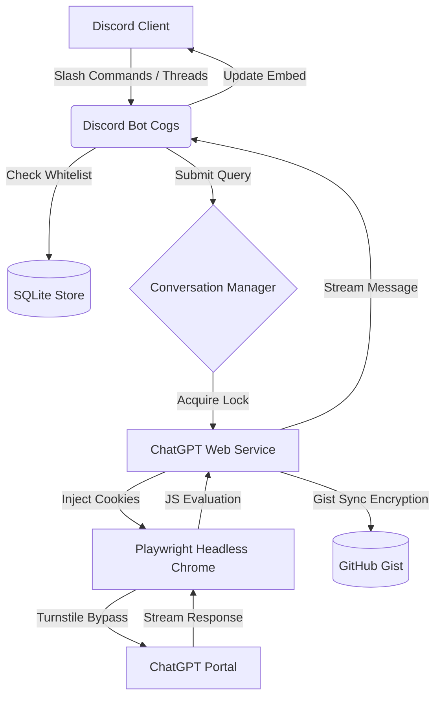

# Boundier 🤖 

[](https://render.com)
[](https://python.org)
[](https://playwright.dev)

**Boundier** is an **autonomous browser-based** Discord AI companion that operates directly through **ChatGPT's web interface** using **headless browser automation**. The name signifies **"Breaking Boundaries"**, representing the ability of the bot to break out of the standard ChatGPT web interface constraints and pipe intelligent conversations directly into your Discord community workspace.

---

> [!WARNING]
> ## DISCLAIMER: FOR LEARNING & EXPERIMENTAL PURPOSES ONLY
>
> **Boundier** is an experimental hobby project created to explore browser automation, Playwright, persistent browser sessions, and Discord-native AI workflows. It is **not intended for production use, commercial deployment, or as a replacement for official APIs.**
>
> **This project is built with genuine respect for OpenAI and its work.** Boundier is **not affiliated with, endorsed by, or supported by OpenAI**, and is not intended to circumvent or replace OpenAI's official offerings.
>
> **Important:** Boundier includes browser automation techniques designed to maintain a stable, authenticated browser session and improve automation reliability. These mechanisms exist solely to support the project's intended functionality and **must not** be used to abuse services, evade platform protections for malicious purposes, or violate applicable terms or policies.
>
> Browser automation is inherently fragile and may stop working at any time due to changes in the ChatGPT web interface. Future updates may require code or selector changes before the project functions correctly again.
>
> **Use this software entirely at your own risk.** By using Boundier, you acknowledge that browser automation may stop working without notice, may require maintenance after ChatGPT updates, and that you are solely responsible for ensuring your usage complies with OpenAI's Terms of Use and any other applicable policies.
>
> This repository exists purely as a personal learning and research project for developers interested in browser automation, software architecture, and Discord integrations.
---

## 🌟 Key Features

* 👤 **Direct ChatGPT Integration:** Avoids expensive API token fees by driving a **real headless Chromium browser** authenticated under your personal ChatGPT account.
* 🔄 **Private Gist Session Syncing:** Encrypts and syncs browser cookies/storage states seamlessly to a private GitHub Gist, allowing the cloud host to boot up authenticated and auto-renew tokens back to the Gist during runtime.
* 🔒 **Dynamic User Restriction:** Restricts bot access to a maximum of **5 registered users** per bot instance. The first 5 distinct users who send commands are whitelisted dynamically, protecting browser contexts and rate limits from abuse.
* 🧵 **Dynamic Thread Routing:** Automatically creates and organizes conversations inside **Discord text threads**, matching titles to ChatGPT's auto-generated sidebar topics.
* ⚡ **Resource & IPC Optimization:** Custom JS evaluations (`page.evaluate`) and throttled poll loops keep CPU/IPC footprints minimal and eliminate event-loop lag. Operates stably on Render's **512 MB RAM** free tier.
* 📸 **Web-based Troubleshooting / Diagnostics:** Exposes a secure web endpoint serving browser diagnostics screenshots (`/diagnostics/session_unverified.png` or `bubble_wait_error.png`) on port 10000.
* 🎛️ **Interactive UI Elements:** Responses are rendered inside **clean white Discord embeds** with interactive buttons to view the original prompt, copy text, or retry generations.

---

## 🏗️ Architecture



* **`PlaywrightDriver` ([driver.py](file:///app/boundier/chatgpt/driver.py)):** Manages persistent Chromium contexts, injects decrypted session cookies, and handles Cloudflare Turnstile hydration checks.
* **`ChatGPTService` ([service.py](file:///app/boundier/chatgpt/service.py)):** Performs page actions such as submitting prompts and files via JavaScript, polling generation streams, and capturing diagnostic screenshots.
* **`SQLiteStore` ([sqlite_store.py](file:///app/boundier/storage/sqlite_store.py)):** Manages thread mappings, SQLite summaries, and user whitelist registration.
* **`BoundierBot` ([bot.py](file:///app/boundier/discord_bot/bot.py)):** Initializes the Discord client, registers slash commands (`/ask`, `/new`), and listens to message events.

---

## 🛠️ Installation & Setup

### Prerequisite: Private Gist & Session Setup
Because cloud servers run in headless environments, you must log in locally first to solve the initial authentication challenge:

1. Clone the repository and install dependencies:
   ```bash
   pip install -r requirements.txt
   playwright install chromium
   ```
2. Create a **Private GitHub Gist** and generate a **GitHub Personal Access Token (PAT)** with `gist` scope.
3. Configure `config.yaml` with `playwright.headless: false` for your local runs.
4. Launch the local sync script:
   ```bash
   $env:PYTHONPATH="."
   python scratch/sync_local_to_gist.py
   ```
   * Enter an **`ENCRYPTION_KEY`** (passphrase) of your choice when prompted.
   * A Chromium window will open. Go to `https://chatgpt.com`, log in manually with your account (Google, email, etc.), and complete the process.
   * Once successfully authenticated, the script will automatically encrypt the session cookies and push them to your private Gist.

---

### Cloud Deployment (e.g., Render)

1. Create a new **Web Service** on Render connected to your repository.
2. Render will automatically detect the `Dockerfile` and build it.
3. Configure the following **Environment Variables** in the Render Dashboard:
   * `DISCORD_TOKEN`: Your Discord bot application token.
   * `GITHUB_PAT`: The GitHub PAT with `gist` access.
   * `ENCRYPTION_KEY`: The passphrase chosen during your local sync run (used to decrypt cookies on boot).
   * `PORT`: Set to `10000` (Render health check).

---

## 📝 Configuration (`config.yaml`)

```yaml
discord:
  token: "YOUR_DISCORD_BOT_TOKEN"
  admin_channel_id: 0
  command_prefix: "/"
  watched_categories: []

playwright:
  headless: true
  user_data_dir: "browser_profile/"
  timeout_ms: 30000
  viewport:
    width: 1280
    height: 720
```

---

## 💡 Naming Context
> [!NOTE]
> I always liked the name **Boundier** and originally named a hackathon project after it. However, that name is far more suited for this project ("Breaking Boundaries" from ChatGPT's web UI). The original hackathon repository has been renamed to **Cognitive Firewall**.
