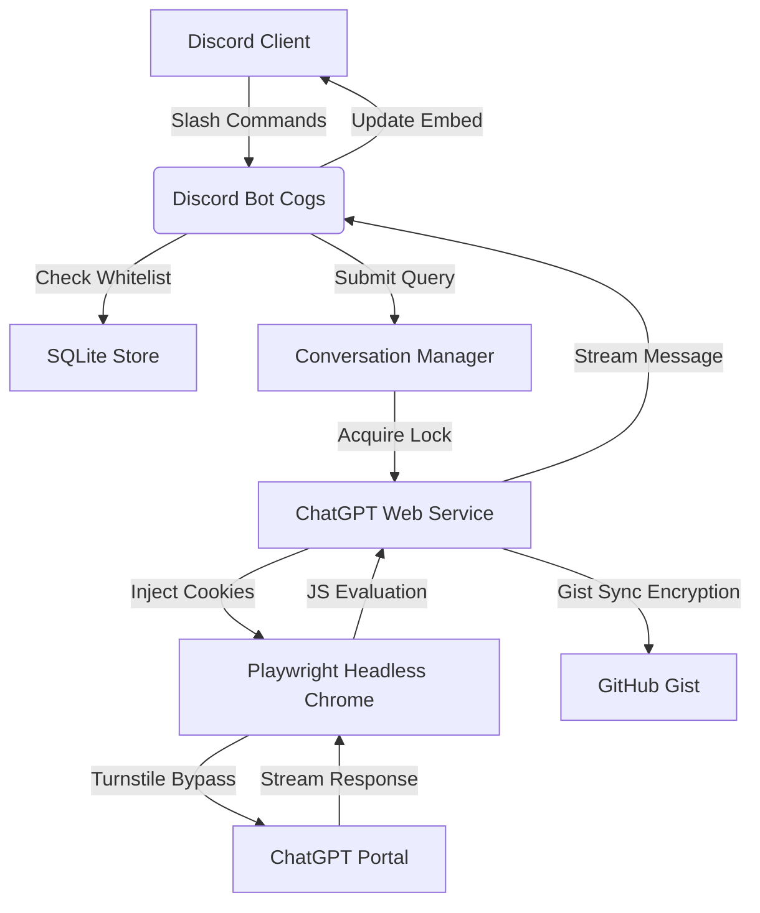

# Boundier 🤖 

### 💬 Full ChatGPT on Discord: **No API key. No token costs. Zero.** 🚀

[](https://render.com)
[](https://python.org)
[](https://playwright.dev)
[](https://github.com/keepsloading/Boundier)
[](https://chatgpt.com)

> **Tired of paying per token? Boundier brings the full ChatGPT experience (including GPT, web search, memory, and file uploads) directly into your Discord server, completely free.**

**Boundier** is an **autonomous browser-based** Discord AI companion that drives **ChatGPT's real web interface** via headless Playwright automation. Instead of routing through the expensive OpenAI API, it authenticates as *you* in a cloud Chromium session and pipes live ChatGPT conversations straight into Discord threads, at **$0 per message**.

The name signifies **"Breaking Boundaries"**: breaking free from API paywalls, rate limits, and token costs that make running an AI community bot prohibitively expensive.

---

> [!WARNING]
> ## DISCLAIMER: FOR LEARNING & EXPERIMENTAL PURPOSES ONLY
>
> **Boundier** is an experimental hobby project created to explore browser automation, Playwright, persistent browser sessions, and Discord-native AI workflows. It is **not intended for production use, commercial deployment, or as a replacement for official APIs.**
>
> **This project is built with genuine respect for OpenAI and its work.** Boundier is **not affiliated with, endorsed by, or supported by OpenAI**, and is not intended to circumvent or replace OpenAI's official offerings.
>
> **Important:** Boundier includes browser automation techniques designed to maintain a stable, authenticated browser session and improve automation reliability. These mechanisms exist solely to support the project's intended functionality and **must not** be used to abuse services, evade platform protections for malicious purposes, or violate applicable terms or policies.
>
> Browser automation is inherently fragile and may stop working at any time due to changes in the ChatGPT web interface. Future updates may require code or selector changes before the project functions correctly again.
>
> **Use this software entirely at your own risk.** By using Boundier, you acknowledge that browser automation may stop working without notice, may require maintenance after ChatGPT updates, and that you are solely responsible for ensuring your usage complies with OpenAI's Terms of Use and any other applicable policies.
>
> This repository exists purely as a personal learning and research project for developers interested in browser automation, software architecture, and Discord integrations.
---

## 🌟 Key Features

* 🆓 **Zero API Cost:** Runs through your **personal ChatGPT account** in a headless Chromium browser: no OpenAI API key, no per-message billing, no rate-limit tiers. Every message costs the same: **nothing**.
* 🧠 **Full ChatGPT Feature Set:** Because it drives the real web UI, you get **GPT, web search, file analysis, ChatGPT Image 2 generation, memory, and custom instructions**; the complete ChatGPT Plus experience, not a stripped-down API subset.
* 💾 **Native Memory & Personalization:** Inherits ChatGPT's built-in persistent memory and user profiles from your real account. No vector database, no embeddings pipeline; ChatGPT already remembers your users' preferences across sessions for free.
* 🔄 **Private Gist Session Syncing:** Encrypts and syncs browser cookies/storage states to a private GitHub Gist, so the cloud host boots up pre-authenticated and automatically refreshes the session on every request.
* 🔒 **Dynamic User Restriction:** Limits bot access to a maximum of **5 registered users** per instance. The first 5 Discord users to send a command are whitelisted, protecting the shared browser session from abuse.
* 🧵 **Smart Thread Routing:** Every conversation lives in its own **Discord thread**, automatically titled to match ChatGPT's auto-generated sidebar topic, keeping your server channels organized.
* 🎛️ **Interactive Discord UI:** Responses render in **clean embeds** with action buttons to copy text, view the original prompt, retry a generation, or browse web-search citation links.
* ⚡ **Lightweight Cloud Hosting:** Custom JS scraping and throttled poll loops keep memory usage low enough to run on Render's **512 MB free tier**.
* 📸 **Live Diagnostics Endpoint:** A secure web endpoint (`/diagnostics/...`) exposes browser screenshots for real-time health monitoring without SSH access.

---

## 🏗️ Architecture



---

## 🎬 Demo

Here is a preview of Boundier in action, showcasing its image generation and vision/analysis capabilities inside Discord:

### 🖼️ Image Generation (ChatGPT Image 2)


### 👁️ Image Analysis & Vision


* **`PlaywrightDriver` ([driver.py](file:///app/boundier/chatgpt/driver.py)):** Manages persistent Chromium contexts, injects decrypted session cookies, and handles Cloudflare Turnstile hydration checks.
* **`ChatGPTService` ([service.py](file:///app/boundier/chatgpt/service.py)):** Performs page actions such as submitting prompts and files via JavaScript, polling generation streams, and capturing diagnostic screenshots.
* **`SQLiteStore` ([sqlite_store.py](file:///app/boundier/storage/sqlite_store.py)):** Manages thread mappings, SQLite summaries, and user whitelist registration.
* **`BoundierBot` ([bot.py](file:///app/boundier/discord_bot/bot.py)):** Initializes the Discord client, registers slash commands (`/ask`, `/new`), and listens to message events.

---

## 🛠️ Installation & Setup

### Prerequisite: Private Gist & Session Setup
Because cloud servers run in headless environments, you must log in locally first to solve the initial authentication challenge:

1. Clone the repository and install dependencies:
   ```bash
   pip install -r requirements.txt
   playwright install chromium
   ```
2. Create a **Private GitHub Gist** and generate a **GitHub Personal Access Token (PAT)** with `gist` scope.
3. Configure `config.yaml` with `playwright.headless: false` for your local runs.
4. Launch the local sync script:
   ```bash
   $env:PYTHONPATH="."
   python scratch/sync_local_to_gist.py
   ```
   * Enter an **`ENCRYPTION_KEY`** (passphrase) of your choice when prompted.
   * A Chromium window will open. Go to `https://chatgpt.com`, log in manually with your account (Google, email, etc.), and complete the process.
   * Once successfully authenticated, the script will automatically encrypt the session cookies and push them to your private Gist.

---

### Cloud Deployment (e.g., Render)

1. Create a new **Web Service** on Render connected to your repository.
2. Render will automatically detect the `Dockerfile` and build it.
3. Configure the following **Environment Variables** in the Render Dashboard:
   * `DISCORD_TOKEN`: Your Discord bot application token.
   * `GITHUB_PAT`: The GitHub PAT with `gist` access.
   * `ENCRYPTION_KEY`: The passphrase chosen during your local sync run (used to decrypt cookies on boot).
   * `PORT`: Set to `10000` (Render health check).

---

## 📝 Configuration (`config.yaml`)

```yaml
discord:
  token: "YOUR_DISCORD_BOT_TOKEN"
  admin_channel_id: 0
  command_prefix: "/"
  watched_categories: []

playwright:
  headless: true
  user_data_dir: "browser_profile/"
  timeout_ms: 30000
  viewport:
    width: 1280
    height: 720
```

---

## 💡 Naming Context
> [!NOTE]
> I always liked the name **Boundier** and originally named a hackathon project after it. However, that name is far more suited for this project ("Breaking Boundaries" from ChatGPT's web UI). The original hackathon repository has been renamed to **Cognitive Firewall**.
