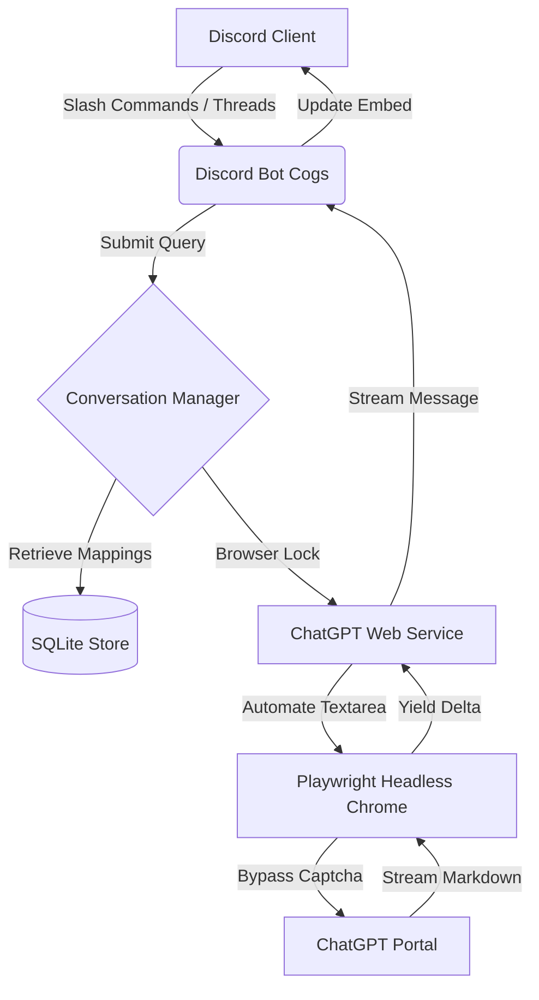

# Boundier 🤖 

[](https://render.com)
[](https://python.org)
[](https://playwright.dev)

**Boundier** is an autonomous browser-based Discord AI companion that operates directly through ChatGPT's web interface using headless browser automation. The name signifies **"Breaking Boundaries"**, representing the ability of the bot to break out of the standard ChatGPT web interface constraints and pipe intelligent conversations directly into your Discord community workspace.

---

> [!WARNING]
> ## DISCLAIMER: FOR LEARNING & EXPERIMENTAL PURPOSES ONLY
>
> **Boundier** is an experimental hobby project created to explore browser automation, Playwright, persistent browser sessions, and Discord-native AI workflows. It is **not intended for production use, commercial deployment, or as a replacement for official APIs.**
>
> **This project is built with genuine respect for OpenAI and its work.** Boundier is **not affiliated with, endorsed by, or supported by OpenAI**, and is not intended to circumvent or replace OpenAI's official offerings.
>
> **Important:** Boundier includes browser automation techniques designed to maintain a stable, authenticated browser session and improve automation reliability. These mechanisms exist solely to support the project's intended functionality and **must not** be used to abuse services, evade platform protections for malicious purposes, or violate applicable terms or policies.
>
> Browser automation is inherently fragile and may stop working at any time due to changes in the ChatGPT web interface. Future updates may require code or selector changes before the project functions correctly again.
>
> **Use this software entirely at your own risk.** By using Boundier, you acknowledge that browser automation may stop working without notice, may require maintenance after ChatGPT updates, and that you are solely responsible for ensuring your usage complies with OpenAI's Terms of Use and any other applicable policies.
>
> This repository exists purely as a personal learning and research project for developers interested in browser automation, software architecture, and Discord integrations.
---

## 🌟 Key Features

* 👤 **Direct ChatGPT Integration:** Avoids expensive API token fees by driving a real headless Chromium browser authenticated under your personal ChatGPT account.
* 🛡️ **Session Management & Stability:** Configured with robust browser profiles, matching user-agent strings, locale headers, and platform synchronization to ensure a stable and reliable browser session on headless server environments.
* 🧵 **Dynamic Thread Routing:** Automatically creates and organizes conversations inside Discord text threads, matching titles to ChatGPT's auto-generated sidebar topics.
* 💾 **Session Injection & Export:** Run a simple local script to extract active authenticated login cookies and inject them as an environment variable (`CHATGPT_STORAGE_STATE`) to deploy headlessly on cloud servers.
* ⚡ **Resource Optimization:** Consolidates all Chromium browser, renderer, and GPU operations into unified configurations. Operates stably under tight resource constraints (runs comfortably on Render's **512 MB RAM** free tier).
* 🎛️ **Interactive UI Elements:** Responses are rendered inside clean white Discord embeds with interactive buttons to view the original prompt, copy text, or retry generations.

---

## 🏗️ Architecture



* **`PlaywrightDriver` ([driver.py](file:///app/boundier/chatgpt/driver.py)):** Manages persistent Chromium contexts, launches Chrome with custom sandbox and memory flags, injects session cookies, and runs page initialization scripts to strip automated signatures.
* **`ChatGPTService` ([service.py](file:///app/boundier/chatgpt/service.py)):** Performs page actions such as submitting prompts via JavaScript, checking the status of the Send/Stop buttons, and scraping the streaming response markdown.
* **`SQLiteStore` ([sqlite_store.py](file:///app/boundier/storage/sqlite_store.py)):** Manages mapping persistence between Discord thread/channel IDs and ChatGPT conversation UUIDs.
* **`BoundierBot` ([bot.py](file:///app/boundier/discord_bot/bot.py)):** Initializes the Discord client, registers slash commands (`/ask`, `/new`, `/archive`), and listens to message events.

---

## 🛠️ Installation & Setup

### Prerequisite: Local Browser Session Export
Because cloud servers (like Render) run in headless environments, you cannot perform manual login challenges or verify captchas on them. You must first log in locally:

1. Clone the repository and install dependencies:
   ```bash
   pip install -r requirements.txt
   playwright install chromium
   ```
2. Launch the bot locally in headed mode:
   * Edit `config.yaml` and set `playwright.headless: false`.
   * Run the bot: `python -m boundier.main`
   * A Chromium window will open. Go to `https://chatgpt.com`, log in with your account, and close the browser.
3. Export your login session cookies:
   ```bash
   python -m tests.export_session
   ```
   Copy the generated JSON array output. This contains your active login cookies.

### Cloud Deployment (e.g., Render)

1. Create a new **Web Service** on Render connected to your repository.
2. Render will automatically detect the `Dockerfile` and build it.
3. Configure the following **Environment Variables** in Render:
   * `DISCORD_TOKEN`: Your Discord application bot token.
   * `CHATGPT_STORAGE_STATE`: The JSON cookie array copied from the exporter script.
   * `PORT`: Set to `10000` (Render's health check binds here).
---

## 📝 Configuration (`config.yaml`)

```yaml
discord:
  token: "YOUR_DISCORD_BOT_TOKEN"
  admin_channel_id: 0
  command_prefix: "/"
  watched_categories: []

playwright:
  headless: true
  user_data_dir: "browser_profile/"
  timeout_ms: 30000
  viewport:
    width: 1280
    height: 720
```

---

## 💡 Naming Context
> [!NOTE]
> I always liked the name **Boundier** and originally named a hackathon project after it. However, that name is far more suited for this project ("Breaking Boundaries" from ChatGPT's web UI). The original hackathon repository has been renamed to **Cognitive Firewall**.
